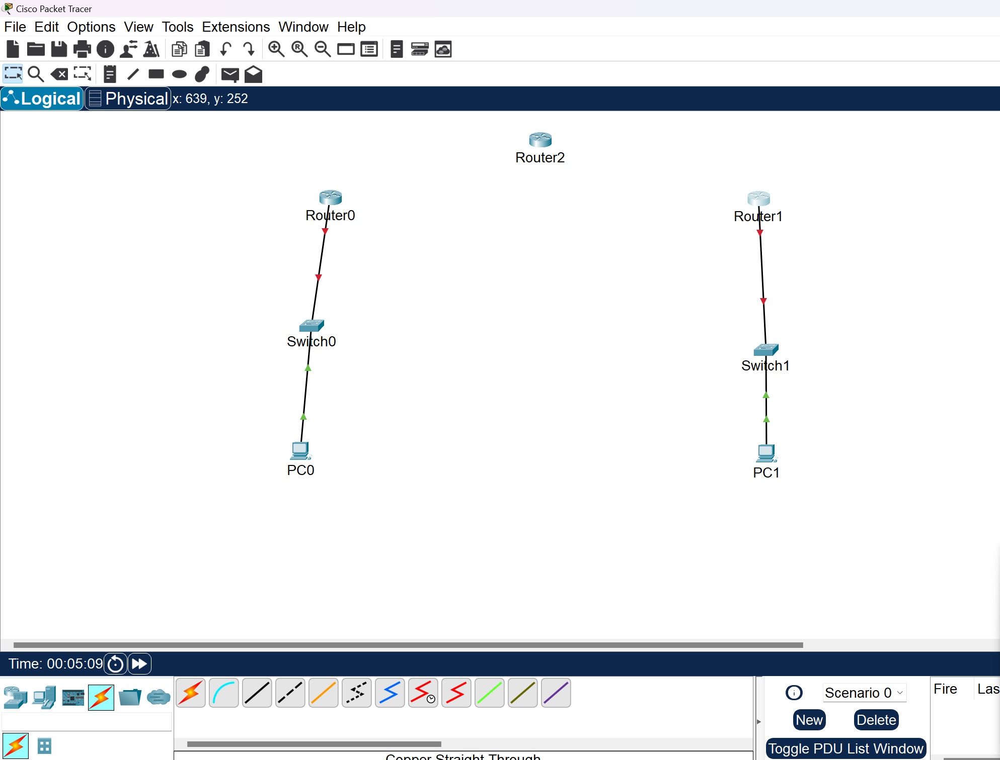
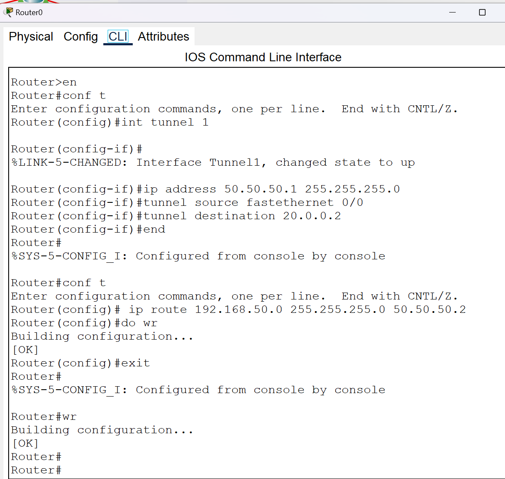
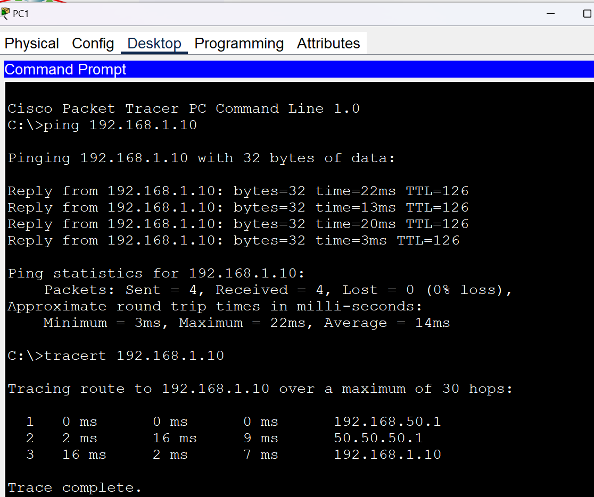
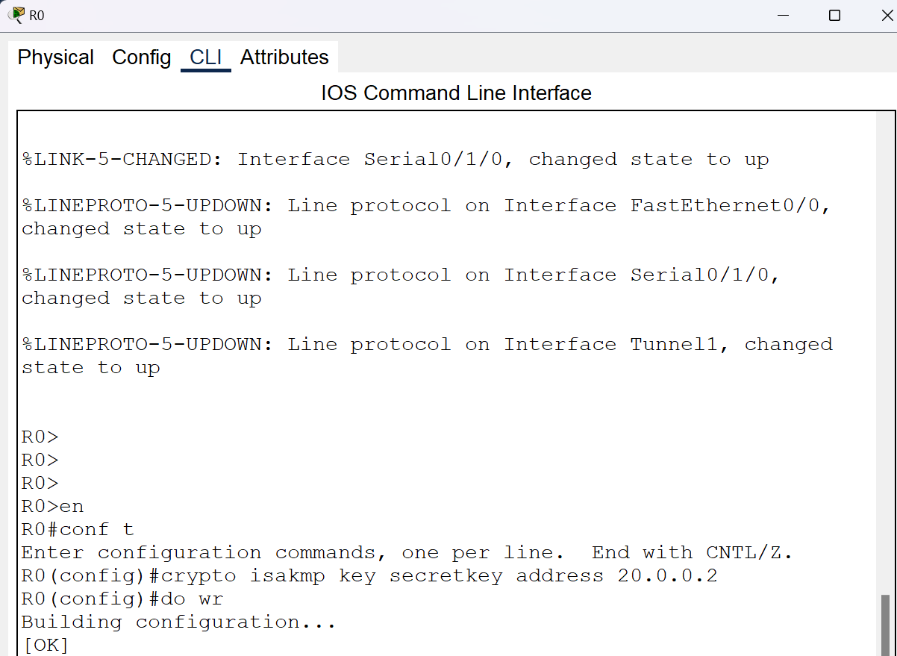
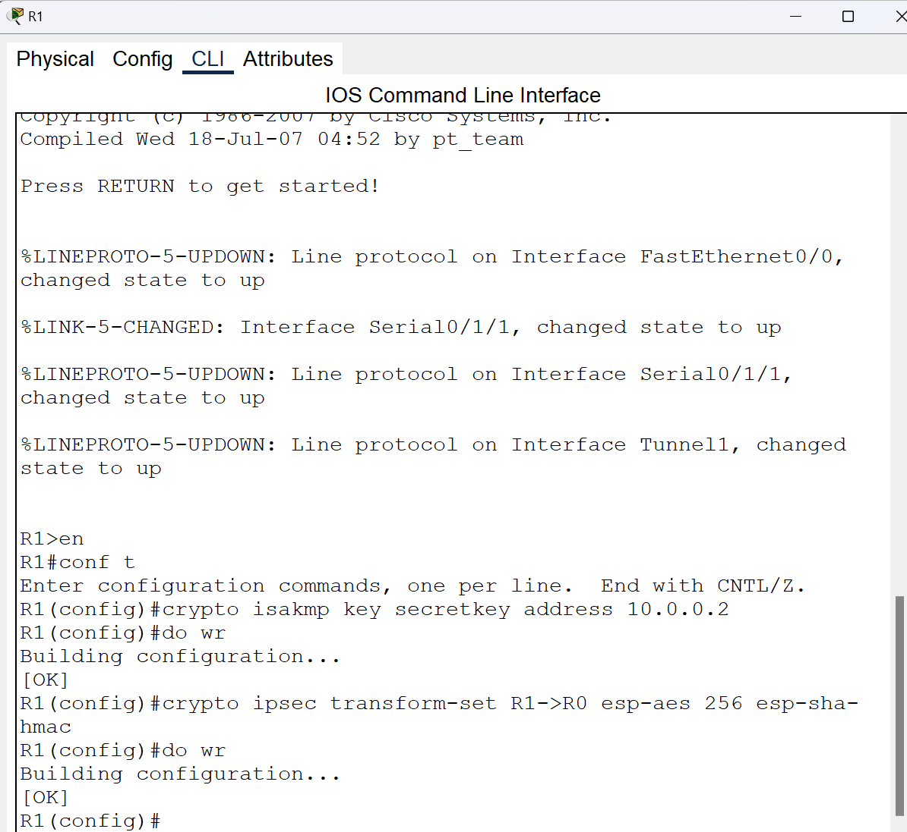
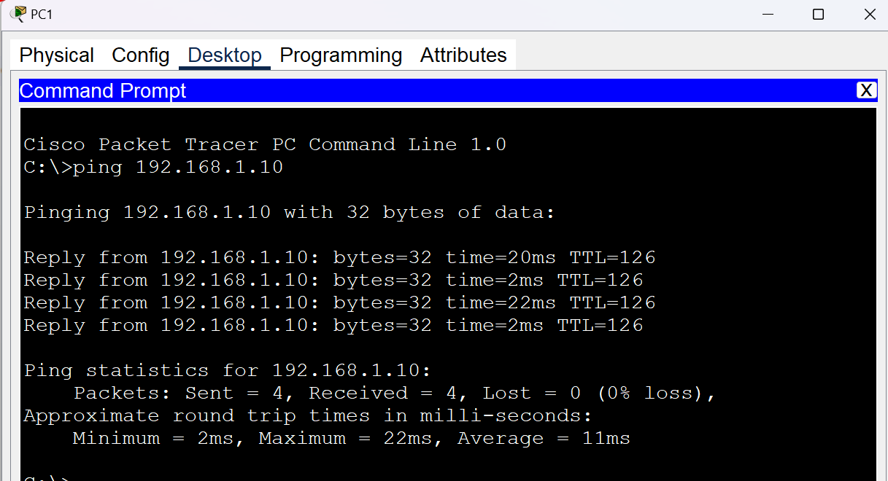

# GRE over IPsec VPN Lab

## Overview

This project demonstrates the implementation of a GRE tunnel secured with
IPsec in a simulated enterprise network environment using Cisco Packet Tracer.

The goal of the lab was to establish connectivity between remote networks
and secure the communication between routers using IPsec.

## Technologies & Concepts

- Cisco Packet Tracer
- Cisco IOS
- GRE Tunneling
- IPsec VPN
- Static Routing
- Access Control Lists (ACL)
- ISAKMP
- Diffie-Hellman
- AES-256
- SHA-HMAC
- Crypto Maps

## Network Configuration

The lab consists of multiple routers and end devices connected through
separate networks.

GRE tunnels were configured between the routers to provide connectivity
between remote networks.

Static routes were configured to ensure that traffic could reach the
remote networks through the tunnel.

## IPsec Implementation

IPsec was configured to secure traffic between the routers.

The implementation included:

- ACL configuration for interesting traffic
- ISAKMP configuration
- Pre-shared key configuration
- Diffie-Hellman Group 5
- IPsec transform set
- AES-256 encryption
- SHA-HMAC authentication
- Crypto map configuration
- Applying the crypto map to the appropriate interface

## Security Configuration

The IPsec transform set used:

- **Encryption:** AES-256
- **Authentication:** SHA-HMAC
- **Key Exchange:** Diffie-Hellman Group 5

A pre-shared key was configured between the VPN peers.

## Verification

Connectivity between the remote networks was tested using ping after the
GRE and IPsec configurations were completed.

Successful communication confirmed that the network and VPN configurations
were functioning correctly.

## Skills Demonstrated

- VPN configuration
- GRE tunneling
- IPsec implementation
- Cisco IOS configuration
- Network routing
- ACL configuration
- Encryption and authentication concepts
- Network troubleshooting
- Connectivity testing

## Lab Environment

This project was completed in a controlled educational lab environment
using Cisco Packet Tracer.

## Project Evidence

### 1. Network Topology
The network topology used for the GRE over IPsec VPN implementation.

### 2. GRE Tunnel Configuration
GRE tunnel configuration between the remote routers.

### 3. GRE Routing & Verification
Routing configuration and connectivity verification after establishing the GRE tunnel.

### 4. IPsec / ISAKMP Configuration
ISAKMP configuration used to establish the secure VPN parameters.

### 5. IPsec Transform Set
IPsec transform-set configuration using AES-256 encryption and SHA-HMAC authentication.

### 6. Final Connectivity Test
Final connectivity verification after completing the GRE over IPsec VPN configuration.

